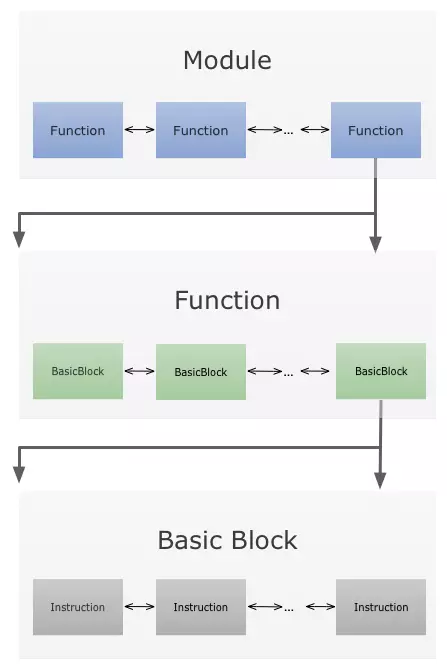
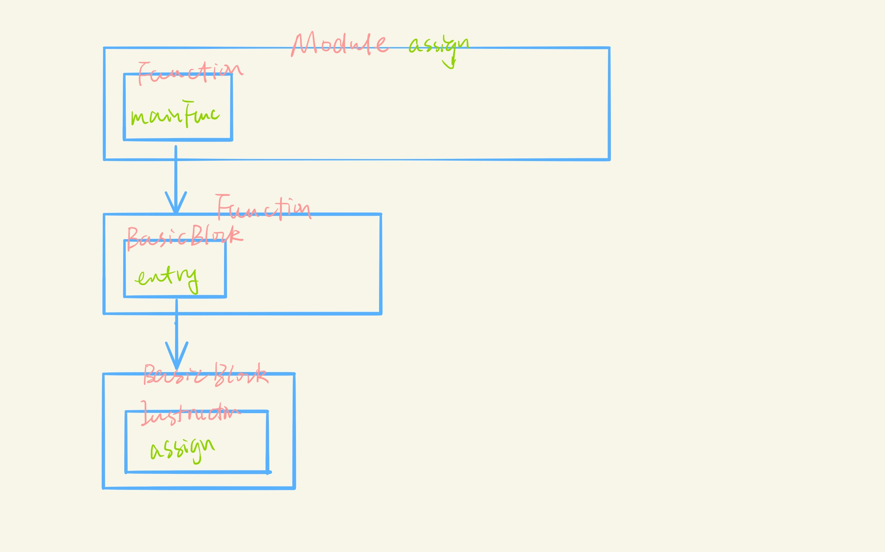
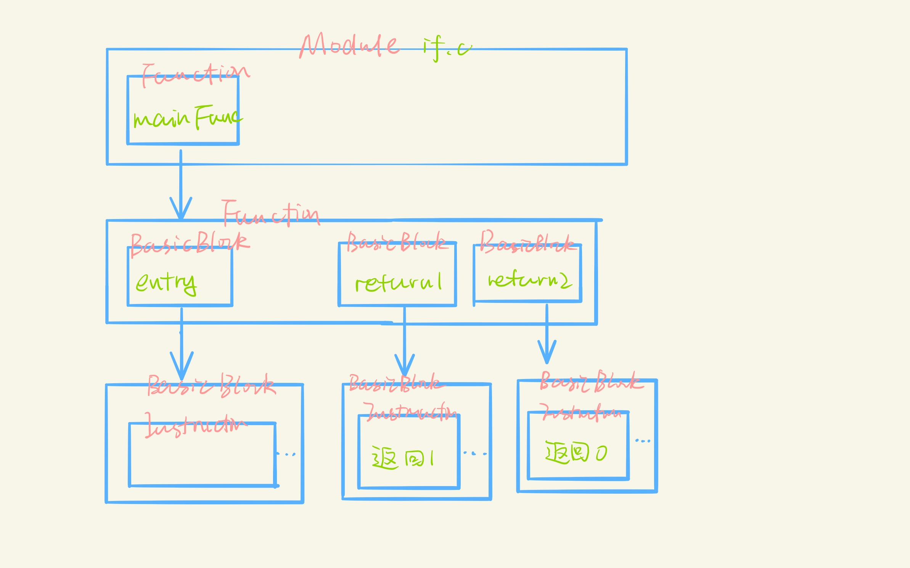
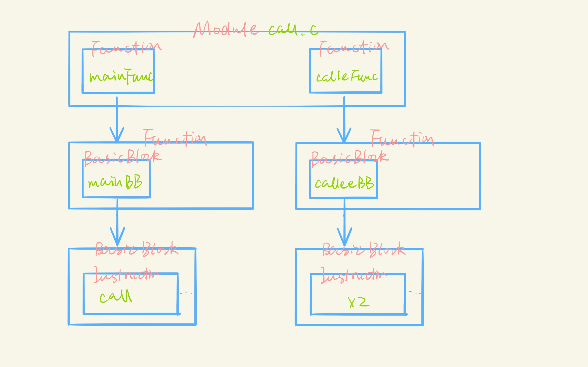
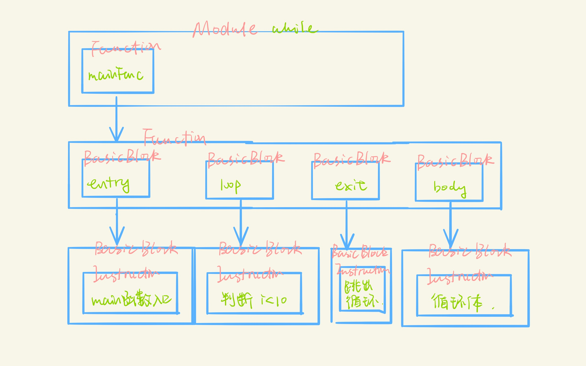
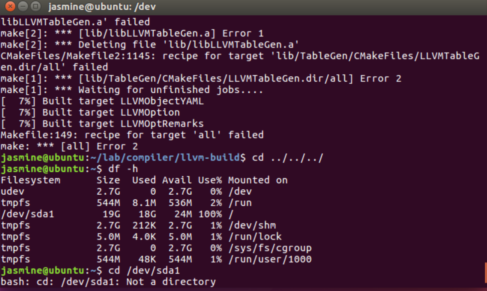
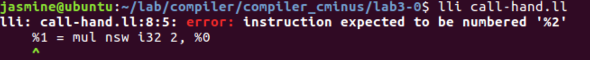

## lab3-0实验报告

姓名: 杨舒静 

学号: PB17151774

### 实验要求

1. 配置llvm IR 环境以及编译器环境
2. 学习LLVM IR语法
3. 学习用cpp调用LLVM IR库来生成LLVM IR中间表示

### 实验结果



llvm 核心类的结构关系如上。故可以得到如下结论
- 对于每一个程序应当创建一个为程序名的`Module`类
- 对于每一个函数应当创建一个`Function`类
- 对于每一个代码段在需要时需要创建`BasicBlock`类

以下根据本次实验中的小程序中类之间的依赖关系(由于关系较为简单没有采用标准的类图, 选择了与上图相同的格式，更为直观)

注1:为了更好地显示`BasicBlock`之间的关系, 下图省略了`instructions`类的各个实例, 以伪代码表示大致操作。

注2: 由于模糊地理解了原实验报告中要求
>描述你的代码片段和每一个BasicBlock的对应关系

可能有所冗余，在此为提高工作量致歉

#### assign.c

generator代码与中间代码关系代码如注释所示
```cpp
auto mainFun = Function::Create(FunctionType::get(TYPE32, false), GlobalValue::LinkageTypes::ExternalLinkage, "main", module); //define i32 @main() {
auto entry = BasicBlock::Create(context, "entry", mainFun); // entry:
```
即`entry`为主函数的入口, 通过以下函数将标签与对应功能的中间代码段绑定
```cpp
builder.SetInsertPoint(entry);
```

#### if.c

```cpp
auto entry = BasicBlock::Create(context, "entry", mainFun); // entry:
    
// create branches
auto return1 = BasicBlock::Create(context, "return1", mainFun); // return1:
auto return2 = BasicBlock::Create(context, "return2", mainFun); //return2:
```
通过条件语句跳转到`return1`和`return2`
```LLVM
br i1 %1, label %return1, label %return2
```
`return1`和`return2`的部分分别返回常数1和0

#### call.c

generator代码与中间代码关系代码如注释所示
```cpp
auto mainFun = Function::Create(FunctionType::get(TYPE32, false), GlobalValue::LinkageTypes::ExternalLinkage, "main", module); // define i32 @main(){
auto mainBB = BasicBlock::Create(context, "entry", mainFun); // entry
auto calleeFun = Function::Create(FunctionType::get(TYPE32, Ints, false), GlobalValue::LinkageTypes::ExternalLinkage, "callee", module); //define i32 @callee(i32){

auto calleeBB = BasicBlock::Create(context, "calleeEntry", calleeFun);
    builder.SetInsertPoint(calleeBB); // calleeEntry:

```
通过以下语句调用函数及传递参数
```cpp
auto call = builder.CreateCall(calleeFun, {retLoad}); // %3 = call i32 @callee(i32 %2)
```
#### while.c

generator代码与中间代码关系代码如注释所示
```cpp
auto loop = BasicBlock::Create(context, "loop", mainFun); // loop:
auto body = BasicBlock::Create(context, "body", mainFun); //body:
auto exit = BasicBlock::Create(context, "exit", mainFun); //exit:
```
其中`loop`标签所对应的部分为while条件判断, `body`标签对应的部分为while循环体, `exit`为函数返回部分。具体每部分操作如下所示
```
loop:
  %4 = load i32, i32* %2 ; i
  %5 = load i32, i32* %3; 10 
  %6 = icmp slt i32 %4, 10
  br i1 %6, label %body, label %exit

body: 
  %7 = load i32, i32* %1; a
  %8 = add nsw i32 %4, 1; i = i + 1
  %9 = add nsw i32 %7, %8; a = a + i
  store i32 %8, i32* %2
  store i32 %9, i32* %1
  br label %loop

exit:
  %10 = load i32, i32* %1
  ret i32 %10
}
```

以下为小代码功能段示例(*可能这部分理解错了原本`实验结果表达的意思`*)
#### 常见变量创建
```cpp

// 创建Module
auto module = new Module("assign.c", context);
// 创建Function
auto mainFun = Function::Create(FunctionType::get(TYPE32, false), GlobalValue::LinkageTypes::ExternalLinkage, "main", module);
// 创建BasicBlock
auto mainBB = BasicBlock::Create(context, "entry", mainFun);
```

#### 调用函数
```cpp
// 调用函数
auto call = builder.CreateCall(calleeFun, {retLoad});
// 获取参数 若为多个参数则为vector
auto arg = calleeFun->arg_begin();
// 函数返回
builder.CreateRet(res);
```

### 实验难点

#### 配置llvm环境

在编译安装llvm过程中, 由于硬件资源的不足(如上所示), 多次编译失败。尽管分配了4核, 4G内存仍然无法正常编译安装debug版本。在扩容后仍然艰难，于是最终选择了release版本, 经过大约1h30min的编译终于顺利编译安装。

在后续实验步骤中发现, LLVM 编译速度确实较慢。

#### 编码

实验过程中手动编写中间代码文件中出现了以上报错。发现不在函数头插入一个entry的label的话就会要求多一个“寄存器”保存地址。

查阅doc后发现


>Unnamed temporaries are numbered sequentially (using a per-function incrementing counter, starting with 0). Note that basic blocks and unnamed function parameters are included in this numbering. For example, if the entry basic block is not given a label name and all function parameters are named, then it will get number 0.

故如果在entry basic block中添加了label则临时寄存器变量从0开始计数。

#### 区分临时变量类型
临时变量类型可能为`i32`, `i32*`。区分每一个临时变量类型有利于减少冗余代码。比如函数参数类型为`i32`时可以直接作为返回值或者返回值表达式中的参数

### 实验总结
本次实验入门了llvm-ir, 初步感受了中间代码的魅力所在。

#### Reference
[基本llvm语法](https://juejin.im/post/5ac2e17b5188254851534da2)

[doc1](https://mapping-high-level-constructs-to-llvm-ir.readthedocs.io/en/latest/basic-constructs/functions.html#simple-public-functions)

[llvm-doc](https://llvm.org/docs/LangRef.html)
