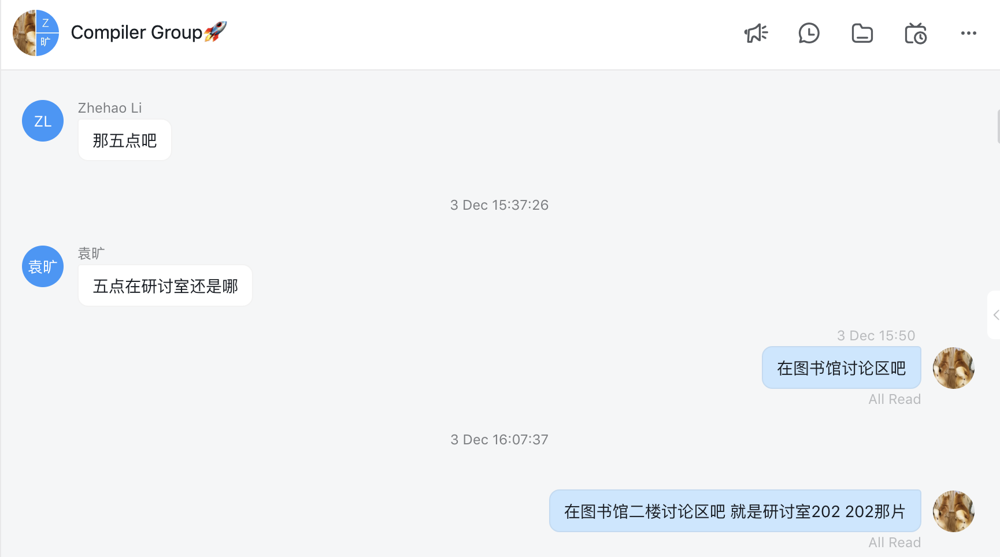

# 团队工作记录
杨舒静 PB17151774

袁旷 PB17081543

李喆昊 PB17050941

## 学习过程
选择了`DCE`和`ADCE`两个程序
根据个人时间安排，袁旷负责学习Pass类的基本知识和DCE的流程，并设计两个情况的 IR 代码优化实例。学习完成后向其他人介绍代码的整体结构以及DCE优化的主要思想。
杨舒静和李喆昊负责详细学习`ADCE`的程序。

## 讨论1

时间：12.3 17:00～18:30
地点：图书馆 芳华
参与者：杨舒静、袁旷、李喆昊
主题：经过讨论选择`DCE`和`ADCE`两个 Pass 做分析，确定分工，以及时间安排与接下来的学习工作计划。

## 讨论2

时间：12.5 17:00～18:30
地点：图书馆 芳华
参与者：杨舒静、袁旷、李喆昊
主题：袁旷介绍学习情况，讲解所选 Pass 代码的整体结构、DCE 优化的基本思想、使用 opt 优化时需要注意的问题。杨舒静、李喆昊进行对 ADCE 代码阅读的分工。

### 过程描述

- 更新records
- 更新DCE、report、两个优化实例
- 更新ADCE、init commit of report
- 对ADCE中的实现细节进行讨论

### 结论
本次实验我们团队三个成员通过充分的交流和讨论，按时完成了所需要学习和编写的任务。在此次实验中，我们分工明确，合理的进行任务划分，确保了任务完成的高效率。同时，通过将学习成果进行分享与交流，我们队伍的三个成员对所涉及的知识也有了全面的理解和认识，有不小的收获。
