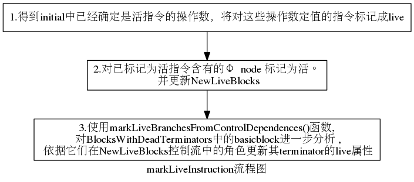
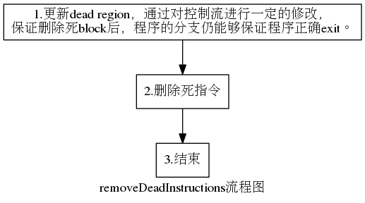

# lab3-2实验报告

杨舒静 PB17151774

袁旷 PB17081543

李喆昊 PB17050941

## 实验要求

了解 LLVM Pass 相关的基础知识（包括 Pass 的类型，接口与使用方法），尝试构造能被优化的 LLVM IR 代码，用所选的 Pass 对代码进行优化，找出被优化的部分并说明 Pass 的行为。最后阅读所选 Pass 的源代码，理解该 Pass 优化的流程并叙述。

## 报告内容 

### 集合1 —— dce

#### 1. Pass 的类型与作用

`DCE` 按功能划分属于`Tranform Pass`，按子类进行划分属于 `Function Pass`，它的作用是对函数进行遍历，删除函数中的死代码。

#### 2. 用 Pass 进行优化的实例说明

源 LLVM IR:

```l
define dso_local i32 @main() #0 {
  %1 = alloca i32, align 4
  %2 = alloca i32, align 4
  store i32 0, i32* %1, align 4
  store i32 0, i32* %2, align 4
  %3 = load i32, i32* %2, align 4
  %4 = add nsw i32 %3, 1
  %5 = load i32, i32* %2, align 4
  ret i32 %5
}
```

可以看到，函数体内的第五第六行关于 %3，%4 的两条代码是死代码，即 %3，%4 被创建之后并不会被再次引用，这两行代码并不影响程序执行结果。

使用 DCE 优化后的 LLVM IR:

```
define dso_local i32 @main() {
  %1 = alloca i32, align 4
  %2 = alloca i32, align 4
  store i32 0, i32* %1, align 4
  store i32 0, i32* %2, align 4
  %3 = load i32, i32* %2, align 4
  ret i32 %3
}
```

可以看到，通过 DCE Pass 的作用，上述两条死代码成功被删除，程序得到优化。

#### 3. Pass 流程叙述

该结构体`DECLegacyPass`中包含三个函数：

- `initializeDCELegacyPassPass`的作用是 Pass 运行前的初始化。
- `getAnalysisUsage`的作用是获取其他 Pass 的分析信息，保证与其他 Pass 进行交互的正确性
- `runOnFunction`是 Pass 运行的主要函数，通过对 LLVM IR 代码中的函数进行遍历，删除死代码。

下面主要对 `runOnFunction`函数的流程进行说明。

在`runOnFunction`函数中，将所需分析的函数 F 传入 `eliminateDeadCode`函数中，进行死代码删除，流程为：

1. 对函数中的每一条指令进行遍历，每当发现一条死指令时，就检查与该指令的每一个操作数相关的其他指令，若这些指令也是死指令，那就把它们放入一个向量`WorkList`中保存，最后将当前遍历的这条死指令删除。
2. 在对函数中的指令遍历时，检查当前遍历的指令是否在`WorkList`中，若是，则跳过（这些指令最后被集中处理，不必重复操作）。
3. 在对函数遍历完成后，对`WorkList`中的指令进行再进行 1 中的操作（检查该指令相关的其他指令是否为死指令，若是则放入向量中，最后把自身删除），直至`WorkList`为空。

### 集合2 —— adce

#### 1. Pass 的类型与作用

`ADCE` 按功能划分属于`Tranform Pass`，按子类进行划分属于 `Function Pass`，它的作用是对函数进行遍历，以更加激进的方式删除函数中的死代码。它先假定所有指令都是死的，直到某一指令被证明不是死指令。相比于 `DCE`，`ADCE`能删除更多死的计算指令，尤其是在循环计算中。

#### 2. 用 Pass 进行优化的实例说明

源 LLVM IR:

```
define dso_local i32 @main() #0 {
  %1 = alloca i32, align 4
  %2 = alloca i32, align 4
  %3 = alloca i32, align 4
  store i32 0, i32* %1, align 4
  store i32 1, i32* %2, align 4
  ret i32 0
}
```

可以看到，函数体内的第三行代码 %3 在之后没有被引用，是死代码。

使用 ADCE 优化后的 LLVM IR:

```
define dso_local i32 @main() {
  %1 = alloca i32, align 4
  %2 = alloca i32, align 4
  store i32 0, i32* %1, align 4
  store i32 1, i32* %2, align 4
  ret i32 0
}
```

可以看到，通过 ADCE Pass 的作用，第三行无用的 `alloca`指令被成功删除，程序得到优化。

#### 3. Pass 介绍

#### 3.1 关键变量及所设计的概念

1. **PDT(post dominance tree)**: 后向支配树。其以`Exit Program`的节点为根
2. **CFG(Control Flow Graph)**: 控制流图
3. **InstInfo**: 将每一条指令与其对应的指令信息InstInfoType存放在一个向量中,其中InstInfoType包含指令是否为live以及指令所在的basicblock。
4. **BlockInfo**: 将每一个块与其对应的指令信息BlockInfoType存放在一个向量中，其中InstInfoType包含当前块是否为live以及当前块的terminator等信息。
5. **WorkList**: 已知为活的指令集合，有待标记其定值指令(及phi节点)为活
6. **BlobcksWithDeadTerminator**: 目前没有发现有live terminator 的BasicBlock
7. **DEAD terminator**: 指程序**一定不会**达到的terminator 
8. **LIVE terminator**: 指程序**可能**到达的terminator

    Note:为什么需要分别维护`DEAD terminator` 和`DEAD Block`
    事实上在标记Terminator为活的同时会将该block标记为活(还会将其所在块的后继标记为活)。只有在最后重写控制流图时才会单独标记terminator为活。


#### 3.2 总体框架
与其他pass类相同，主要需要重载以下三个函数。在优化过程中顺序调用
1. Initialization(): 找到必然为活的块，记录块终结符的信息
2. markLiveInstructions()：进一步分析，找出其余为活的块
3. removeDeadInstructions()：根据已知死块重写控制流，删除死代码

以下将分别介绍三个函数的主要含义，具体步骤以及分析其中一些步骤需要执行的原因。

#### 主要函数1: Initialization()执行步骤: 


1. 遍历输入函数的每一个基本块，建立BlockInfoVec。遍历每一个基本块里面的指令，建立InstruInfo。用于保存指令和基本块相关的信息。

2. 标记always live的指令（也称为“root” instruction），相应的，将这些always live的指令所在的块也标记成live。（在markLive函数中执行）always live的指令是以下几类指令：不进行instrumenting constants分析的 
   1. 异常处理指令 
   2. 有side-effects（a.写内存如malloc and alloca或者 b.可能进行抛出异常操作）的指令。

3. 如果一个basicblockA是死的，但是在dom tree中该basicblock指向活blockB，那么把这个block的terninator标记为live。 相应的，此指令所在的块也标记成live。

4. 已知一个块一定有terminator，PDT的根节点是一个Exit Program的虚拟节点。
   如果PDT的第一层孩子的终结符不是return语句，则将PDT的第一层孩子bb(即到PDT的不是无条件跳转的)的孩子全部标记为live。同时将回边的头所在的块的终结符标记为活。

5. 设定程序入口块为活(但是其终结符不一定为活)

6. 最后，将包含死terminator的块放到 BlocksWithDeadTerminators中。

7. 补充：如果一个块是live的，且其terminator是无条件跳转，那么把其terminator也标记成live。（在MarkLive()中执行。）

**总结**：Initialization是在执行过程通过初步分析，将该标为live的指令都标为live，相应的这些指令所在的块也变成live。被标记为活的指令会被放到worklist中。


#### 主要函数2: markLiveInstructions()



对worklist进行迭代处理，分别标记数据流和控制流中的活指令，具体步骤如下
1. 对数据流进行迭代
   1. 首先，遍历已经确定是活的指令的操作数，将含有这些操作数对应的定值指令也标记成活的。
   2. 如果这个活指令涉及phi node，即，这个live instruction的operand依赖程序的data flow。LLVM官方文档中对PHI (Φ) nodes的描述如下：

    >  A consequence of single assignment are PHI (Φ) nodes. These are required when a variable can be assigned a different value based on the path of control flow.

    那么在当前块中得到指向phi node的指针，将这个phi node 标记为live。注意，有live phi node的block在CFG图（control flow 图）中的前驱一定要是CFlive的，即control flow live。这些control flow live的前驱 block称为 NewLiveBlocks。

2. 根据控制流的依赖关系，标记控制流中的活分支(`markLiveBranchesFromControlDependences`)
   记其中的一个Block With Dead Terminator为A。如果A是一个NewLiveBlock B 的 control dependence source，即B的执行依赖于A，那么A的teminator肯定要是活的，否则B不能执行。所以修改A的terminator的live属性为live，相应地A变为live。 
   详细分析见下3.4.1

**总结** markLiveInstructions()基于初始化的结果，通过对operand的分析，进一步标记了可能的全部live指令。

#### 3.4.1 markLiveBranchesFromControlDependences



该函数总体利用后向推理，要义是：迭代地考虑NewLiveBlocks, 找到依赖的控制流块(即在控制流中为其支配的块)，则标记为live(相关注释如下所示)。可以发现如果一个块为live，即程序可能执行到该处，则其控制依赖的块也可能执行到该处，则通过这种思想则可以根据初始化中判断的常活(isAlwaysLive)的块后向推理出活块。

>The dominance frontier of a live block X in the reversecontrol graph is the set of blocks upon which X is controldependent. 
>The following sequence computes the set of blockswhich currently have dead terminators that are controldependence sources of a block which is in NewLiveBlocks.


NewLiveBlocks指在初始化和数据流分析过程中新发现的活块; 将块加入NewLiveBlocks集合的情况有以下两种
  - UD链中标记定值语句所在的块为NewLiveBlock
  - 将含有PhiNode的块的所有前驱块均NewLiveBlock

实例化一个`ReverseIDFCalculator`计算器, 利用它计算当前NewLiveBlock的控制支配前驱(dominance frontier)。具体步骤如下

1. 将当前NewLiveBlocks初始化给计算器
2. 计算NewLiveBlocks中在控制流上依赖的块，存放在IDFBlocks中
3. 清除NewLiveBlocks
4. 将IDFBlocks中的块的终结符标记为live, 并加入NewLiveBlocks(检查原来是否是活块，避免重复加入)

##### 分析
1. 在最后一步中标记终结符为live时，如果该终结符是非条件跳转语句会触发将其所在的块所有后继块全部标记为活的操作，即将其将其加入NewLiveBlocks。在函数的哪一部分迭代计算了NewLiveBlocks的控制前驱？
  在markLiveInstructions中有**大**迭代循环处理了这种情况。

#### 主要函数3: removeDeadInstructions

1. 使用updateDeadRegions函数更新dead region. 

> A dead region is the set of dead blocks with a common live post-dominator.

更新dead region的目的是通过对控制流进行一定的修改（加入unconditional branch），保证删
除死block后，程序的分支仍然能够保证活block一定能被执行到， 以及保证程序能正确exit。
  
  **updateDeadRegions()**

  由于死代码的删除可能涉及控制流语句，故需要找到在控制流图中与含有死终结符的块相关的块(如其后继), 重写其相关的控制流图(control flow graph), 以确保在删除相关死代码后，控制流可正常跳转。以上操作主要封装在`updateDeadRegions`函数中

  此时，程序已经标记所有活块，则当前仍然含有死终结符的块一定为为死块。如果在保证控制流逻辑不变的情况下删除该部分的死块需要考虑与该块相关的活边是否能正常跳转。

  基于以上分析，该函数完成了以下操作
  1. 遍历所有含有死终结符的块
  2. 如果该块的终结符是无条件跳转语句，则将其直接标记为活，并return。如果不是继续执行以下步骤
  3. 找到后序意义上最近的后继, 创建一条无条件跳转到该块的指令，并将该指令标记为活
  4. 告知其在PDT上的所有孩子节点，该前驱为死(使得该孩子块中的PhiNode知道应该选择哪个值)
  5. 删除块到孩子块的边(除了该块到最大后继的块)


2. 删除死指令。


**总结**：removeDeadInstructions() 执行一些删除死指令的善后工作。


### 分析DCE和ADCE的相同点与不同点

#### 相同点
1. 在执行过程上：两者都是维护一个worklist，即不断迭代该变量，并分析新产生的活/死代码，直到没有新产生的代码。

#### 不相同点
1. 两者的假设不同：DCE是基于假设所有代码都是活的，找到死代码。而ADCE是基于假设所有代码是死的，找到活代码。
2. ADCE在判断一个指令是否为活的逻辑比DCE复杂很多，对PDT等控制流有更深入的分析。

## 实验总结

本次实验中针对两种死代码删除的方法DCE，ADCE进行了分析，进一步学习了llvm相关的优化操作，对llvm源代码有了更深入的了解。
