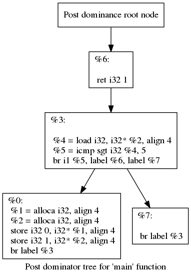

## Initialization(): 

1. 遍历输入函数的每一个基本块，建立BlockInfoVec。遍历每一个基本块里面的指令，建立InstruInfo。用于保存指令和基本块相关的信息。

2. 标记always live的指令（也称为“root” instruction），相应的，将这些always live的指令所在的块也标记成live。（在markLive函数中执行）always live的指令是以下几类指令：不进行instrumenting constants分析的 1. 异常处理指令 2.有side-effects（a.写内存如malloc and alloca或者 b.可能进行抛出异常操作）的指令。

3. 如果一个basicblockA是死的，但是在dom tree中该basicblock指向活blockB，那么把这个block的terninator标记为live。 相应的，此指令所在的块也标记成live。

4. 已知一个块一定有terminator。（terminator可以是br或者return） 且Post dom tree的root 节点的第一个孩子一定是一个return语句。因为函数在CFG中总有exit出口，就算中间有无限循环，无限循环的false在CFG中仍然会指向之后的节点。那么，把Post dom tree中不包含return语句的块的terminator都标记成活的。这样做是因为这些块有可能指向含有return语句的块。相应的，这些块也变成活的了。（但不代表这些块中的所有intruction都是活的。）

    下图是一颗post dom tree.

    

5. 然后，一个函数的入口块一定是活的，不然这个函数没法执行。


6. 最后，将包含死terminator的块放到 BlocksWithDeadTerminators中。
例子：

```c
int main{
    ...
    return 0;
    if(a>0) return 1;
    ...
}
```

这里``if(a>0)`` 和``return 1``两个块是BlocksWithDeadTerminators。
``if(a>0)``这个块不包含return语句，为什么不标记成活的？这是因为这个块不在post dom tree中。函数要结束直接从return 0这个块结束。所以没有一条路径经过if(a>0)到达函数的exit,因此if(a>0)这个块就谈不上dom。

7. 补充：如果一个块是live的，且其terminator是无条件跳转，那么把其terminator也标记成live。（在MarkLive()中执行。）

### 总结：Initialization是在执行过程通过初步分析，将该标为live的指令都标为live，相应的这些指令所在的块也变成live。被标记为活的指令会被放到worklist中

## markLiveInstructions()

1. 首先，得到已经确定是活的指令的操作数，将含有这些操作数的指令也标记成活的。

2. 如果这个liveinstruction的operand涉及phi node(即，这个live instruction的operation依赖程序的data flow。LLVM官方文档中对PHI (Φ) nodes的描述如下：

>  A consequence of single assignment are PHI (Φ) nodes. These are required when a variable can be assigned a different value based on the path of control flow.

)，那么在当前块中创建一个phi node，将这个phi node 标记为live。注意，有live phi node的block在CFG图（control flow 图）中的前驱一定要是CFlive的，即control flow live。这些control flow live的前驱 block称为 NewLiveBlocks。

3. 然后，使用markLiveBranchesFromControlDependences()函数对BlocksWithDeadTerminators中的block进一步分析。记其中的一个Block With Dead Terminator为A。如果A是一个NewLiveBlock B 的 control dependence source，即B的执行依赖于A，那么A的teminator肯定要是活的，不然B就不能执行。所以修改A的terminator的live属性为live，相应地A变为live。 


## removeDeadInstructions()

1. 更新dead region. 什么是dead region？

> A dead region is the set of dead blocks with a common live post-dominator.

更新dead region的目的是通过对控制流进行一定的修改（加入unconditional branch），保证删除死block后，程序的分支仍然能够保证活block一定能被执行到， 以及保证程序能正确exit。

2. 删除死指令。

结束。


什么情况下：是死block？
死block和block with dead terminator的区别？

什么情况下：是死terminator？
什么情况下：是死指令？
