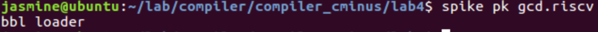
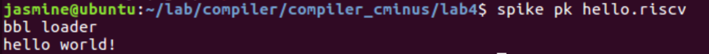

# lab4实验报告

组长：杨舒静 PB17151774
袁旷 PB17081543
李喆昊 PB17050941

## 实验要求
1. 学习配置RISC-V环境，学习利用RISC-V进行机器代码的生成和运行
// TODO:
## 报告内容 

#### 1. RISC-V 机器代码的生成和运行
注：本部分中生成的`gcd.ll`、`gcd.riscv`均在`/report/gcd/`目录下
##### 1.1 LLVM 8.0.1适配RISC-V
  **Step 1**: 安装riscv-tools
  ```bash
  git clone https://github.com/riscv/riscv-tools.git
  git submodule update --init --recursive
  ./build.sh
  ```
  实际执行以上命令时有报错，解决方案在**Trouble Shooting**中详述

  该仓库包含以下模块
  - Spike: the ISA simulator
  - riscv-tests: a battery of ISA-level tests
  - riscv-opcodes: the enumeration of all RISC-V opcodes executable by the simulator
  - riscv-pk: which contains bbl, a boot loader for Linux and similar OS kernels, and pk, a proxy kernel that services system calls for a target-machine application by forwarding them to the host machine
  
  编译完后，应当注意大部分可以执行文件都会安装到$RISCV/bin目录，但pk的默认没有安装(解决方案在**Trouble Shooting**中详述)。
  **Step 2**: 安装`riscv-gnu-toolchains`(此部分中由于网速问题利用了@ibug提供的镜像)
  ```bash
  git clone --recursive https://github.com/riscv/riscv-gnu-toolchain
  ```
  **Step 3**: 编译`riscv-gnu-toolchains`、配置环境变量
  
  添加环境变量
  ```bash 
  export  RISCV="/path-to-riscv/riscv/riscv-tools/riscv-gnu-toolchain"
  export PATH=$PATH:$RISCV/bin
  ```
  按照`riscv-gnu-toolchains` README中的指示，编译`riscv-gnu-toolchains`
  ```bash
  ./configure --prefix=$RISCV
  make
  ```

##### 1.2 lab3-0 GCD样例 LLVM IR 生成 RISC-V源码的过程
  生成的`gcd.ll`、`gcd.riscv`均在`/report/gcd/`目录下

  执行以下命令，将gcd的LLVM IR生成RISC-V源码
  ```bash
   clang -emit-llvm --target=riscv64 -march=rv64gc doc/gcd.c -S -o doc/gcd.ll  -I/opt/riscv/riscv64-unknown-elf/include
   llc gcd.ll -march=riscv64 -o gcd.s
   riscv64-unknown-elf-gcc gcd.s -o gcd.riscv
  ```
  

##### 1.3 安装 Spike模拟器并运行上述生成的RISC-V源码
  在第一步中已经安装成功spike模拟器。

  执行以下命令即可成功运行。
  ```bash
  riscv64-unknown-elf-gcc gcd.s -o gcd.riscv
  ```
  
  执行`Hello world`程序
  
  说明可以正确执行。

##### Trouble Shooting
以下部分将总结在配置环境中遇到的bug以及处理方法

1. 在编译`riscv-gnu-toolchains`遇到`Permission denied`的bug
   这个bug是一个常见情况，一般只需要在sudo权限下运行即可。但是在实际实验过程中发现，sudo指令可能覆盖了之前配置的环境变量，导致连接的执行文件环境变量是系统原生的可执行文件。所以应该在sudo命令中手动添加该环境变量
   
   如在编译`riscv-tools`时应当执行
   ```bash
   sudo RISCV=/opt/riscv ./build.sh
   ```
2. 运行生成的中间代码时无法找到正确的llc
   如果直接执行
   ```bash
   llc gcd.ll -march=riscv64 -o gcd.s
   ```
   会报错`llc: error: error: invalid target 'riscv64'.`

   在`llvm-build/bin`下执行
   ```
   ./llc ~/lab/compiler/compiler_cminus/lab4/gcd.ll -march=riscv64 -o gcd.s
   ```
   则可以正常运行。说明是`llc`的环境变量有问题。事实上在之前实验中`llc`的环境变量配置在了`llvm-install`下，但是本次实验中适配RISCV的将其配置在了`llvm-build`下。所以应当添加环境变量
   ```bash
   export PATH=/home/jasmine/lab/compiler/llvm-build/bin:$PATH
   ```
3. 利用Spike模拟器在运行生成的`RISC-V`源码过程中内存溢出

   执行以下命令时
   ```bash
   spike pk gcd.riscv
   ```

   报错

   ```bash
   terminate called after throwing an instance of 'std::runtime_error'
   what():  couldn't allocate 2147483648 bytes of target memory
   Aborted (core dumped)
   ```

    按照stackoverflow上的指示限制内存运行

    ```bash
    spike -m128 pk gcd.riscv 
    ```
    也将仍然报错。

   该情况实际上是Spike模拟器在`riscv-gnu-toolchains`安装过程中出现了问题。参考[riscv-pk仓库](https://github.com/riscv/riscv-pk/)给出的手动编译的指令，需要在`riscv-tools/riscv-pk/build`重新编译。此时sudo权限下运行编译指令时同样应当配置环境变量。
    ```bash
    sudo RISCV=/opt/riscv ../configure --prefix=$RISCV --host=riscv64-unknown-elf
    sudo RISCV=/opt/riscv PATH=/opt/riscv/bin:$PATH make
    sudo RISCV=/opt/riscv PATH=/opt/riscv/bin:$PATH make install
    ```
    重新运行`spike pk gcd.riscv`, 即可正常运行。

#### 2. LLVM源码阅读与理解

- RegAllocFast.cpp 中的几个问题

  * RegAllocFast* 函数的执行流程？

    答：......

  * *allocateInstruction* 函数有几次扫描过程以及每一次扫描的功能？

    答：......

  * *calcSpillCost* 函数的执行流程？

    答：......

  * *hasTiedOps*，*hasPartialRedefs，hasEarlyClobbers* 变量的作用？

    答：......

- 书上所讲的算法与LLVM源码中的实现之间的不同点

  ......


## 组内讨论内容

- 讨论时间：2019.12.15
- 讨论地点：西图13楼
- 讨论内容：小组分工及配置环境过程中出现的问题
  - `riscv-gnu-toolchains`下载过程中遇到了`Connection-failed`的问题
  - 源码阅读的任务分工

## 实验总结

此次实验有什么收获

## 实验反馈

对本次实验的建议（可选 不会评分）